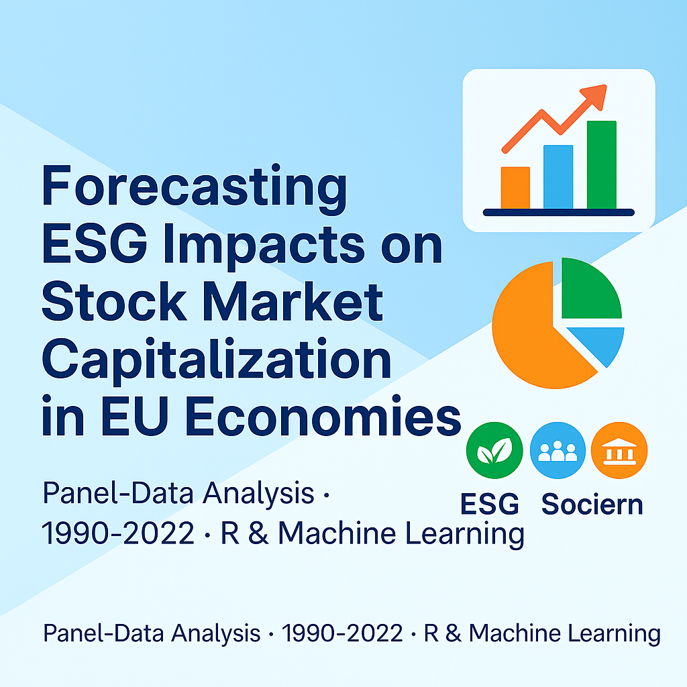

# Forecasting ESG Impacts on Stock Market Capitalization in EU Economies (1990–2022)
### A Data-Driven Look at How Sustainability Shapes Financial Growth

---

## 🌍 Project Summary
This project explores how **Environmental, Social, and Governance (ESG)** practices influence **stock market value** across **European Union countries** between **1990 and 2022**.  
In simple terms, it looks at how things like clean energy use, employment, education, and carbon emissions affect the size and health of each country’s stock market.

By combining real data with intelligent forecasting tools, the project helps governments, investors, and companies understand how **sustainable choices lead to stronger economies** and more stable investments.

---

## 🎯 Key Goals
- Understand how sustainability indicators (like renewable energy and CO₂ emissions) connect to stock market growth.  
- Forecast future market performance for EU countries based on ESG progress.  
- Provide insights that help businesses and policymakers make smarter, greener financial decisions.  
- Show that sustainability and profitability can go hand in hand.

---

## 📊 Data Used
The study draws from trusted public sources:
- **World Bank – World Development Indicators (1990–2022)**  
- **OECD** and **EU Sustainable Finance Databases**  

Data covered all 27 EU economies, focusing on:
- Economic growth (GDP per capita)  
- Environmental progress (CO₂ emissions, renewable energy)  
- Labor and education trends  
- Market capitalization (how large each stock market is compared to its economy)

---

## 🔍 What the Data Revealed (Exploratory Insights)

### 1️⃣ CO₂ Emissions per Capita (1990–2022)

Across Europe, carbon emissions have dropped sharply over the past three decades, proof that climate policies and renewable energy investments are working.  
Countries like **Sweden** and **Denmark** lead the transition, showing that cleaner energy supports long-term stability.

---

### 2️⃣ GDP per Capita Growth (1990–2022)

Income levels have steadily increased across most EU countries. This steady rise links closely to ESG progress, economies investing in education, clean energy, and innovation have seen stronger, more consistent growth.

---

### 3️⃣ Market Capitalization (% of GDP, 1990–2022)

Stock markets grew rapidly but also faced downturns during global crises (1997, 2008, 2020).  
However, economies that invested early in sustainability — such as **Germany**, **France**, and **the Netherlands** — recovered faster and maintained higher long-term market value.

---

## 🧠 Approach in Simple Terms
To keep it understandable:
- The study first cleaned and organized data for each country over 33 years.  
- Then it used both **traditional analysis** and **machine learning** (smart algorithms that find patterns) to predict how ESG factors affect market value.  
- The final step checked how accurate those predictions were and which factors mattered most.

---

## 📈 Key Findings

### Actual vs Predicted Market Capitalization

The predictions matched real data very closely, showing that sustainability indicators can reliably forecast market performance.

### What Drives Market Value Most

The strongest influences on stock market growth were:
- **Renewable energy adoption** – cleaner energy drives steady, long-term value.  
- **Economic output (GDP)** – wealthier nations maintain more resilient markets.  
- **Employment and education** – a skilled, working population keeps markets healthy.  
- **CO₂ reduction** – lower emissions often align with innovation and investor confidence.

---

## 🔮 Forecast Scenarios for 2027

This project didn’t just analyze the past, it forecasted the **future trajectory of market capitalization** across EU countries under continued ESG progress.

### 🇩🇪 Germany – Sustainable Growth Momentum
.png)  
Germany’s forecast shows steady market expansion powered by renewable energy investments and consistent emissions reduction, suggesting long-term financial resilience.

---

### 🇫🇷 France – Moderate Growth with Stable ESG Returns
.png)  
France’s balanced ESG policy mix supports moderate, sustainable market growth, with strong returns from green energy innovation and labor participation improvements.

---

### 🇦🇺 Australia – Emerging ESG Impact Scenario
.png)  
Although outside the EU, Australia’s inclusion demonstrates how developing ESG structures can reshape financial outcomes. The upward trend reflects the potential of transitioning economies under sustainability-driven reforms.

---

## 💡 Insights in Plain Language
- Countries that invested more in **sustainability and green innovation** saw **faster stock market recovery** after economic shocks.  
- **Good governance and workforce participation** strengthen investor trust.  
- **Machine learning models** helped forecast future market performance, showing where investments in ESG can create the biggest returns.  
- In short, **green growth is good business**, not just good policy.

---

## 🏛️ Why This Matters
**For policymakers:**  
Helps guide environmental and economic policies that attract investment and boost employment.

**For investors:**  
Reveals which markets are growing sustainably and which factors signal long-term profit potential.

**For companies:**  
Shows the business value of improving ESG performance and not just for compliance, but for market competitiveness.

---

## 📁 Repository Structure
```plaintext
Forecasting-ESG-Impacts-on-Stock-Market-Capitalization-in-EU-Economies-1990-2022/
│
├── datasets/                 # Processed ESG and financial data (1990–2022)
├── R Script/                 # Scripts for analysis and forecasting
├── visuals/                  # Charts and dashboards
│   ├── CO2 Emissions per Capita.png
│   ├── GDP per Capita.png
│   ├── Market Capitalization.png
│   ├── Actual vs Predicted Market Capitalization.png
│   ├── Random Forest Variable Importance.png
│   ├── Forecast Scenario for Germany (2027).png
│   ├── Forecast Scenario for France (2027).png
│   └── Forecast Scenario for Australia (2027).png
└── README.md
````

---

## 🧾 Citation

> **Solomon Okpuno (2025).** *Forecasting ESG Impacts on Stock Market Capitalization in EU Economies (1990–2022): A Panel-Data and Machine Learning Analysis.*

---

## 👤 Author

**Solomon Okpuno**
📍 Data Scientist | ESG & Financial Analyst | Power BI & R Developer
🔗 [LinkedIn](https://linkedin.com/in/solomon-okpuno-51a907312) | [GitHub](https://github.com/okpunosolomon) | [Email](mailto:okpunosolomon20@gmail.com)

---

⭐ *If you found this project insightful, please star the repository to support open data research in sustainable finance.*

--- 
